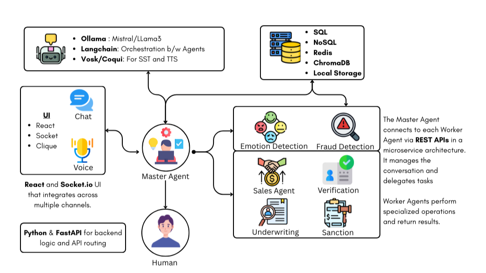

# 🚀 Multi-Agent AI Orchestration Platform

### *Unified System for Provider Data Validation & Omnichannel Retail Sales Automation*

---

## 📌 Overview

This project is a **multi-agent AI orchestration platform** built to automate complex workflows across multiple industries. It combines:

* A **Master Agent** for reasoning, intent detection, and workflow routing
* Domain-specific **Worker Agents** for validation, enrichment, recommendation, inventory, and more
* A **modular backend** to support multiple use cases
* A **conversational UI** for seamless human-like interaction

The system currently implements two major use cases:

### ✓ **Provider Data Validation & Directory Management**

Automates verification and enrichment of healthcare provider information using scraping, registry checks, and confidence scoring.

### ✓ **Omnichannel Retail AI Sales Assistant**

Engages customers with intelligent product recommendations, inventory lookup, and checkout support across digital and in-store channels.

The platform is built with extensibility in mind, allowing new workflows to be introduced by simply adding new agent sets.

---

# 👥 Team (from presentation)

This project is built by **CodeWires**, a team passionate about AI and modern software engineering.

### **Kaustubh Warme — AI Developer & System Architect**

* Designed agentic orchestration for Master–Worker communication
* Built LLM integration, backend routing, and reasoning layer
* Experience: LangGraph, CrewAI, HuggingFace, Node.js, Express

### **Divya Rewade — Backend & AI Developer**

* Implemented business logic, PDF generation, and data flows
* Built mock APIs/databases and automated workflows
* Experience: Node.js, Express, MySQL, REST APIs, LangGraph, CrewAI

*The team’s technical expertise directly influenced the platform’s multi-agent architecture and modular workflow design.*

---

# 🎯 Problem Background (adapted from PPT)

Modern businesses struggle with:

* Maintaining accurate **provider directories**
* Ensuring seamless **customer journeys** across digital channels
* Automating repetitive validation, enrichment, and classification tasks
* Providing human-like assistance without manual intervention
* Scaling operations without increasing human workload

This project addresses these challenges by delivering an **AI-driven, multi-agent system** capable of:

* Understanding user intent
* Automatically routing tasks
* Validating and enriching data
* Providing sales guidance and product matching
* Integrating with backend services and databases

---

# 🧠 Core Solution

The system is an **Agentic AI-powered platform** that automates workflows end-to-end through:

* **Master Agent Orchestration**
* **Specialized Worker Agents**
* **Backend logic + databases**
* **LLM-powered reasoning & multimodal processing**
* **Real-time chat interface for clients and customers**

This enables a fully automated pipeline for:

* Provider profile validation
* Retail customer interaction
* Inventory search
* Offer matching
* Data enrichment
* Escalations via human-in-the-loop

---

# 🧩 Architecture Overview



**Master Agent**
Handles reasoning, state management, workflow orchestration, and delegation.

**Worker Agents**
Each module uses its own set of specialized agents for domain tasks.

---

# 🏥 Use Case 1 — Provider Data Validation & Directory Management

### 🔧 Agents

* **Validation Agent:** Cross-checks name, NPI, credentials, phone, address
* **Enrichment Agent:** Scrapes additional details from public sources
* **Quality Agent:** Flags discrepancies and assigns confidence scores
* **Directory Agent:** Updates provider directories with consolidated profiles

### 🔄 Workflow

1. Input provider data
2. Master Agent routes to validation flow
3. Worker agents verify, enrich, score
4. Unified provider profile generated
5. Summary returned to the user with discrepancies

---

# 🛍️ Use Case 2 — Omnichannel Retail AI Sales Assistant

### 🔧 Agents

* **Recommendation Agent:** Suggests products based on preferences
* **Inventory Agent:** Checks stock across stores
* **Payment Agent:** Handles simulated checkout flows
* **Fulfillment Agent:** Manages delivery/pickup options
* **Offers Agent:** Applies best discounts or loyalty points

### 🔄 Workflow

1. Customer asks for help
2. Intent detected (purchase, comparison, availability, etc.)
3. Master Agent routes to retail workflow
4. Worker agents collaborate
5. Final recommendation or checkout flow completed

---

# 🏗️ Technical Architecture (includes PPT content)

The technical design includes:

### **Multimodal Interface**

* Chat & voice inputs
* Built using **React**, **Socket.io**, and **speech-to-text engines** like Vosk/Coqui

### **Agent Intelligence Layer**

* Orchestration with LangChain / LangGraph
* LLM-based reasoning using open-source or local models
* Embeddings, vector search (ChromaDB) for context retrieval

### **Backend Services**

* Node.js / Express for routing
* Python / FastAPI for agent workflows
* Microservice-style modular structure

### **Data Layer**

* SQL & NoSQL stores
* Redis for caching
* ChromaDB for embeddings
* External APIs for enrichment

### **Human-in-the-Loop**

* Escalates complex or high-risk cases
* Allows partial automation where full automation isn’t appropriate

---

# 🌟 Potential Impact

By automating validation, sales, and decision-making processes, the system delivers:

* Higher data accuracy
* Increased customer satisfaction
* Reduced manual operational load
* Faster response times
* Improved scalability
* Consistent decision logic
* Lower operational costs

---

# 🛠 Tech Stack

### **Backend**

* Python, FastAPI
* Node.js, Express
* LangGraph, CrewAI
* Selenium / BeautifulSoup
* Pandas

### **Frontend**

* React + Vite
* Tailwind
* Socket.io

### **AI**

* LLMs (local or cloud)
* Embedding models (HuggingFace)
* Vector DB (ChromaDB)

### **Storage**

* PostgreSQL / MySQL
* Redis
* JSON/PDF generation

---

# 📦 Project Structure (Standardized)

```
project/
│
├── backend/
│   ├── agents/
│   │   ├── provider/
│   │   ├── retail/
│   │   └── common/
│   ├── workflows/
│   ├── api/
│   └── main.py
│
├── frontend/
│   ├── src/
│   ├── components/
│   └── main.tsx
│
├── data/
│   ├── providers/
│   ├── retail/
│   └── mock/
│
└── README.md
```

---

# 🚀 Running the Project

### Backend

```sh
cd backend
pip install -r requirements.txt
uvicorn main:app --reload
```

### Frontend

```sh
cd frontend
npm install
npm run dev
```


---

# 🔮 Extensibility

You can add new domains easily:

* Add new agents
* Define workflow graph
* Extend intent routing
* Add UI components if needed

The Master Agent automatically integrates new workflows.

---
